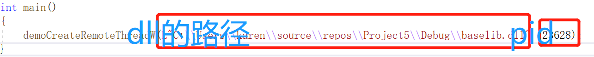
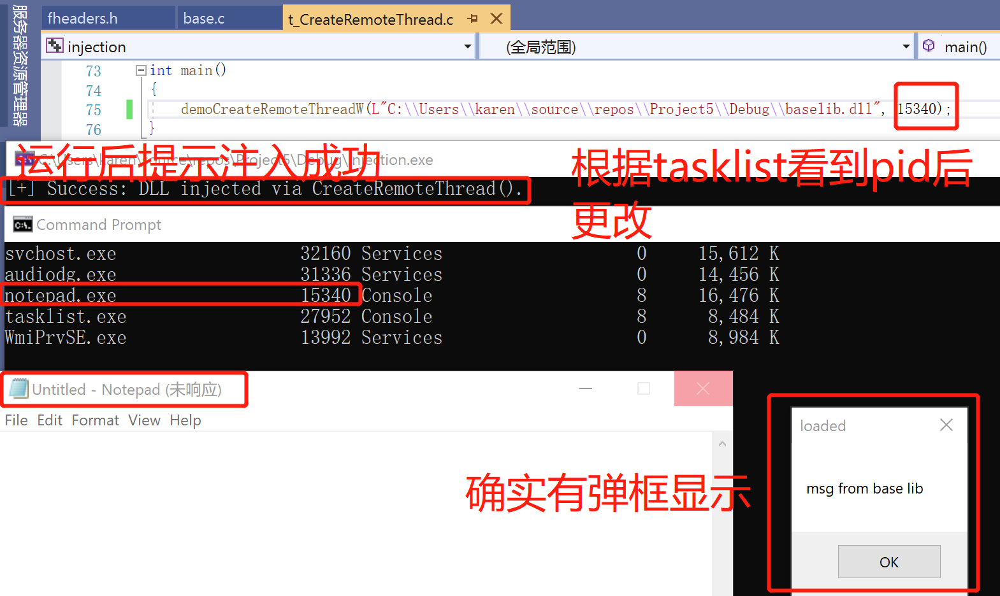
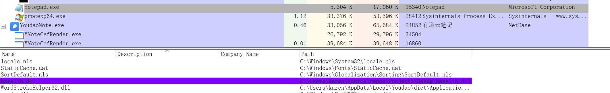

# 创建远程线程实现DLL注入
## 实验一要求
- [x] 查文档，研究远程线程方式注入dll的实例代码的实现原理。
- [x]运行实例代码，向一个目标程序（比如notepad.exe)注入一个我们自行编写的dll，加载运行。
- [x]整合进程遍历的程序，使得攻击程序可以自己遍历进程得到目标程序的pid。
## 实验一实现
* 原理：  
注入Dll：  
1.OpenProcess获得要注入进程的句柄  
2.VirtualAllocEx在远程进程中开辟出一段内存，长度为strlen(dllname)+1;  
3.WriteProcessMemory将Dll的名字写入第二步开辟出的内存中。  
4.CreateRemoteThread将LoadLibraryA作为线程函数，参数为Dll的名称，创建新线程  
5.CloseHandle关闭线程句柄
1. dll文件生成在上节课已完成，本次实验直接使用
2. 使用[dll注入代码来源](https://github.com/fdiskyou/injectAllTheThings)中的t_CreateRemoteThread.c并调用其中的函数

3. 为了确保notepad是32位，打开'Winodws/SysWOW64'中的Notepadcmd中使用```tasklist```查看进程的Pid后更改。
4. 运行后看到确实有弹窗

用process explorer查看确实NotePad被注入了这个dll

* 还有[使用注册表AppInit_DLLs实现DLL注入以及消息钩取实现DLL注入](https://blog.csdn.net/SKI_12/article/details/80777748)
# IAT HOOK
* [Windows Hook原理与实现](https://blog.csdn.net/m0_37552052/article/details/81453591)  
* [API Hook根据实现方式可以分为3类：Address Hook，Inline Hook和利用异常处理 Hook. Address Hook的本质就是劫持函数表。 Iline Hook就是一种简单的跳转操作，它直接修改函数开头的指令，令要hook的API开头跳转到自定义的函数中，常用的有mov rax, address; jmp rax push address; retn这 样的一些指令，不过Inline Hook操作的直接是代码段，所以有时会出现一些奇怪的问题。利用异常处理进行hook感觉要相对复杂些，作为代表的就是模拟一个调试器的行为来进行 hook，在要hook的API开头写入0xcc，运行到此处时就会触发一个BreakPoint异常，然后 交给我们的调试器来处理.](https://blog.csdn.net/qq_35713009/article/details/88537300)
## 实验二要求
如果文件内容是"哈哈哈"改成"呵呵呵".
## 实验二原理
1. 找到exe文件的加载地址（GetModuleHandle(NULL)函数）
2. 找到user32.dll的加载地址，和SetWindowTextW的加载地址
3. 修改IAT内存的属性用VirtualProtect函数
4. 修改IAT->Function值(这个值是函数的真正运行时地址)(dll被主调exe加载到自己的虚拟内存空间，所以直接赋值)
5. 把内存权限修改回去
## 实验二实现
1. [writefile function](https://docs.microsoft.com/en-us/windows/win32/api/fileapi/nf-fileapi-writefile)属于Kernel32.dll  
[IAT Hook原理](https://blog.csdn.net/betabin/article/details/8669347)
2. [iathook代码来源](https://github.com/tinysec/iathook)