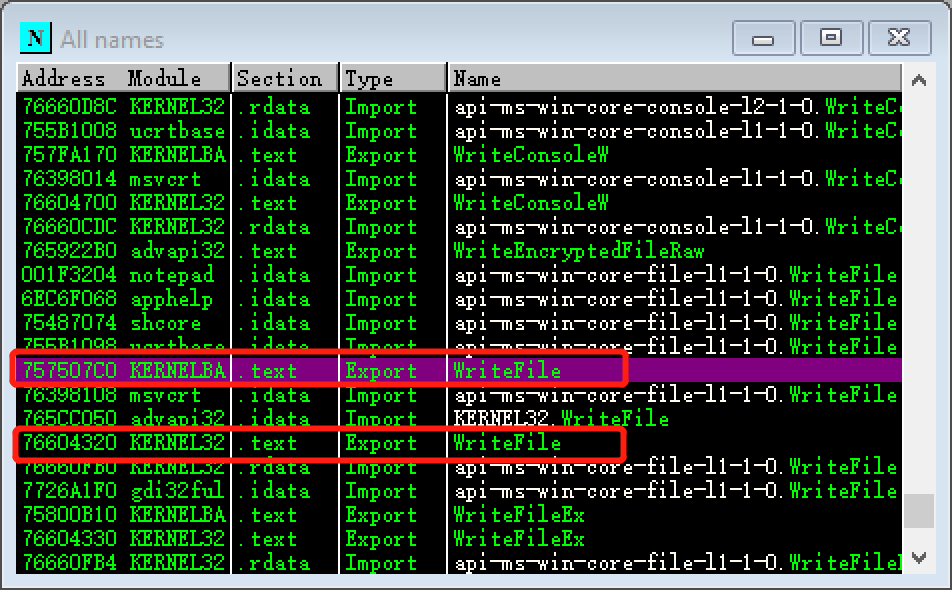
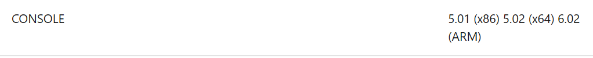
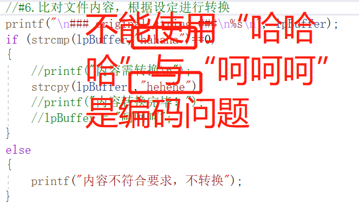

# 创建远程线程实现DLL注入
## 实验一要求
- [x] 查文档，研究远程线程方式注入dll的实例代码的实现原理。
- [x] 运行实例代码，向一个目标程序（比如notepad.exe)注入一个我们自行编写的dll，加载运行。
- [x] 整合进程遍历的程序，使得攻击程序可以自己遍历进程得到目标程序的pid。
## 实验一实现
* 原理：  
注入Dll：  
1.OpenProcess获得要注入进程的句柄  
2.VirtualAllocEx在远程进程中开辟出一段内存，长度为strlen(dllname)+1;  
3.WriteProcessMemory将Dll的名字写入第二步开辟出的内存中。  
4.CreateRemoteThread将LoadLibraryA作为线程函数，参数为Dll的名称，创建新线程  
5.CloseHandle关闭线程句柄
1. dll文件生成在上节课已完成，本次实验直接使用
2. 使用[dll注入代码来源](https://github.com/fdiskyou/injectAllTheThings)中的t_CreateRemoteThread.c并调用其中的函数

3. 为了确保notepad是32位，打开'Winodws/SysWOW64'中的Notepadcmd中使用```tasklist```查看进程的Pid后更改。
4. 运行后看到确实有弹窗

用process explorer查看确实NotePad被注入了这个dll

* 还有[使用注册表AppInit_DLLs实现DLL注入以及消息钩取实现DLL注入](https://blog.csdn.net/SKI_12/article/details/80777748)
## 实验一代码
>code1/base.c生成待注入的.dll文件
>code1/t_CreateRemoteThread.c用于dll注入，fheaders.h是需要用到的头文件
# API HOOK
* [Windows Hook原理与实现](https://blog.csdn.net/m0_37552052/article/details/81453591)  
* [API Hook根据实现方式可以分为3类：Address Hook，Inline Hook和利用异常处理 Hook. Address Hook的本质就是劫持函数表。 Iline Hook就是一种简单的跳转操作，它直接修改函数开头的指令，令要hook的API开头跳转到自定义的函数中，常用的有mov rax, address; jmp rax push address; retn这 样的一些指令，不过Inline Hook操作的直接是代码段，所以有时会出现一些奇怪的问题。利用异常处理进行hook感觉要相对复杂些，作为代表的就是模拟一个调试器的行为来进行 hook，在要hook的API开头写入0xcc，运行到此处时就会触发一个BreakPoint异常，然后 交给我们的调试器来处理.](https://blog.csdn.net/qq_35713009/article/details/88537300)
## 实验二要求
如果记事本写入内容是"hahaha"改成"hehehe".
## 实验二说明
1. 实验原理：  
[writefile function](https://docs.microsoft.com/en-us/windows/win32/api/fileapi/nf-fileapi-writefile)官方文档上显示属于Kernel32.dll  
* OD调试的时候看到kernellab.dll上也有，原来writefile()函数的调用是层层嵌套的，最终调用ntdll.dll里面的writefile，但是只要我们在某一层实现了钩取，就可以实现功能。 
 
2. 实验环境：  
windowsxp-xp3--'开始'--'记事本'
* 本次实验使用的是32位的记事本
* 由于用OD调试win10(X64)以及win7(X64)目录下包括64位和32位的notepad.exe('Windows/notepad.exe'及'Windows/System32/notepad.exe'及'Windows/SysWow64/notepad.exe')一直没找到数据存储的位置
3. 方法一---注入方式的API钩取  
仿照实验一，将fakewritefile.c编译链接成.dll文件，更改t_CreateRemoteThread.c里面dll的路径，以及notepad的pid可以实现本次实验。这样的实现方式思想：更换函数地址，当需要调用目标函数的时候替换为fake函数地址的方式不一样。实验的操作系统里需要安装编译器再运行dll注入的代码，并需要实时修改dll的路径了pid值来实现。
>code2/fakewritefile.c
4. 方法二---调试方式的API钩取：  
学习参考：《逆向工程原理》
* 实验原理：  
1.对想Hook的进程进行附加操作，使进程成为被调试者。  
2.Hook:将API起始的第一个字节修改成0xcc 也就是int3断点。  
3.调用相应API 时，控制权转移到调试器上。
执行需要的操作（参数，返回值等等）。  
4.脱钩： 将0xcc 恢复成原本的字节（为了正常运行API）。  
5.Hook:再次修改为0xcc 也就是int3  断点（为了继续Hook）。  
6.控制权返还给被调试者（进程本身）
## 实验二实现
>video/hookresult.mp4
## 实验二代码
方法一---注入方式的API钩取：
>code2/fakewritefile.c生成用来注入的.dll文件
>code1/t_CreateRemoteThread.c用于dll注入，fheaders.h是需要用到的头文件  

方法二---调试方式的API钩取：
>code2/hookapi.c 将此.c文件编译链接为.exe文件
* 为了生成win32的应用程序,s使用如下编译链接命令  
```cl /c /MT hookapi.c```   
```link /SUBSYSTEM:CONSOLE,5.01  hookapi.obj```  
compiler options:[/MD /MT /LD参数的含义](https://docs.microsoft.com/en-us/cpp/build/reference/md-mt-ld-use-run-time-library?view=vs-2019)  
linker-reference:[/SUBSYSTEM参数的含义](https://docs.microsoft.com/en-us/cpp/build/reference/subsystem-specify-subsystem?view=vs-2019)

* 只能使用英文字符串不能使用中文字符串是编码问题
 
 发现保存.txt的时候默认是ANSI格式。要解决这个问题，使用下列方法先识别编码格式，再将用来判断的字符与.txt文件中的字符转换成同一格式进行比对，然后再替换即可。  
 [字符编码Unicode、UTF-8、ANSI](https://www.jianshu.com/p/c23f3ea5443d)  
 [c++判断文件编码格式](https://blog.csdn.net/bladeandmaster88/article/details/54767557)  
 [C语言判断文件编码格式](https://blog.csdn.net/mydriverc2/article/details/38320587)  
 [UTF-8\Unicode\GB2312格式串转换之C语言版](https://blog.csdn.net/ultraman_hs/article/details/69680956)

