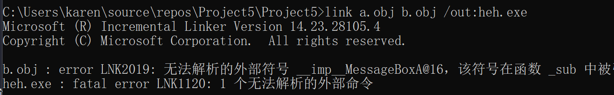
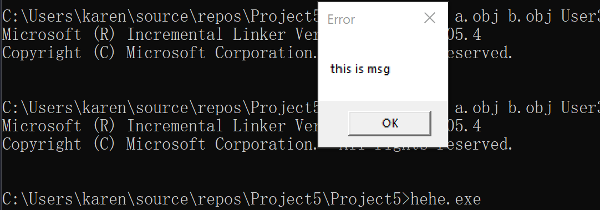
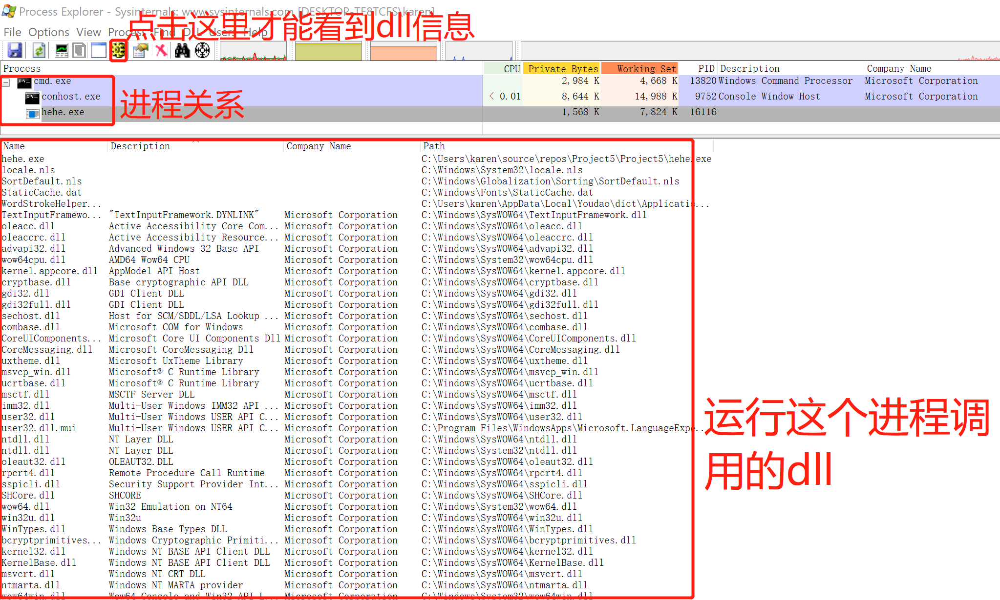
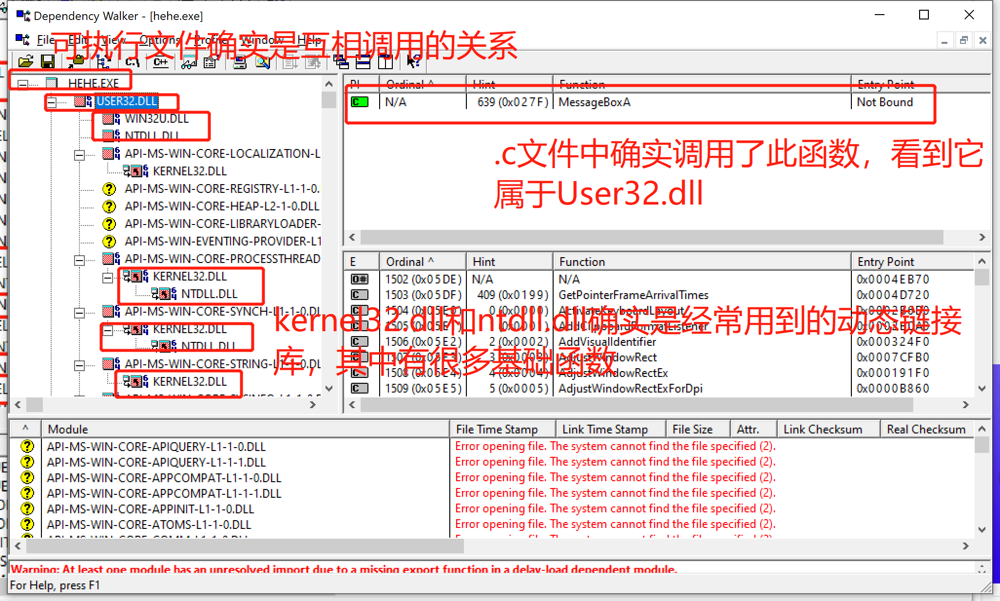
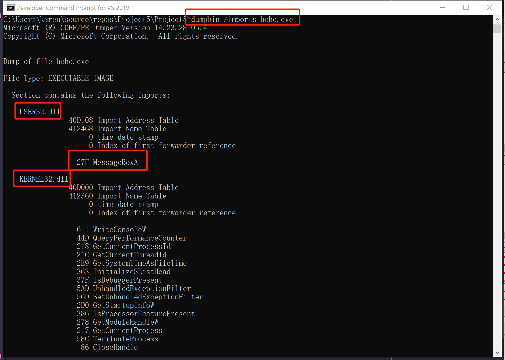
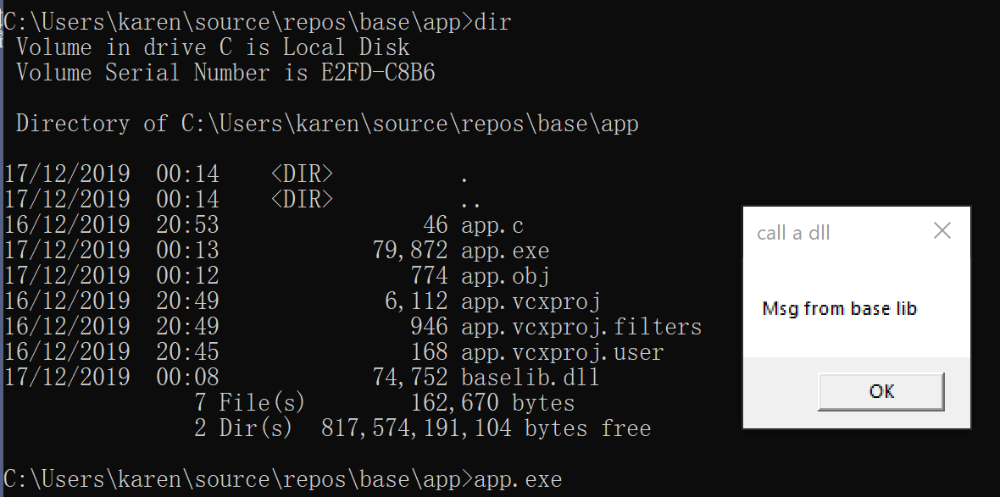

# DLL
## 作业要求
1. 综合使用今天示例代码中的模块遍历，分别使用三个工具（dumpbin,process explorer,dependency walker），查看可执行程序所依赖库，比价结果,分析可执行文件调用的依赖树
2. 自己写dll及exe,并运行exe调用dll.
## 作业完成
### 作业一
#### 先修理论知识
[遍历线程示例代码来源](https://docs.microsoft.com/zh-cn/windows/win32/toolhelp/taking-a-snapshot-and-viewing-processes)：遍历当前系统中的进程，列出这些进程所属的模块，以及这些进程创建的线程。目标：阅读代码，从而理解线程、进程、模块。
* 关于示例代码生成报错的解决办法  
方法一：.cpp改成.c。  两者区别：在编译源文件时，C编译器和C++编译器都会对符号(函数或变量)名作某些修正，但两者采用的修正方法不同，所以两者生成的目标文件不能互相链接。把c的代码放到.c文件中，把c++的代码放到.cpp文件中  
方法二：* [const char *类型的实参与tchar类型的实参不兼容](https://blog.csdn.net/Roy_Yuan_/article/details/80718550)
>example.c中有阅读代码和学习的理解和收获
* 代码效果与任务管理器和cmd'tasklist'结果对比，吻合
#### 自己写一个exe
a.c
```
int main()
{
	sub();
}
```
b.c
```
#include<Windows.h>
int sub()
{
	MessageBox(0, "this is msg", 0, 0);
	return 0;
}
```
使用vs命令行编译链接生成exe
```
cl /c a.c #生成a.obj
cl /c b.c #生成b.obj
```
* link a.obj b.obj /out:hehe.exe #将两个obj拼凑在一起链接成hehe.exe,看到以下报错

查看[MessageBox函数](https://docs.microsoft.com/en-us/windows/win32/api/winuser/nf-winuser-messagebox)library是User32.lib,dll是User32.dll,因此导入User32.lib
```
link a.obj b.obj User32.lib /out:hehe.exe
```
运行结果如下图

#### 使用工具分析hehe.exe的木块调用



可以看到三个工具看到的结果是一致的，hehe.exe调用主要是User32.dll,kerner32.dll,ntdll.dll,依赖数在图二dependency walker工具中非常清晰的展示
#### 拓展学习
1. [导入表和导出表](https://blog.csdn.net/richard1230/article/details/82979057)  
自我总结：导入表是指可执行文件（exe运行，dll执行）要用到的从其他可执行文件调用（导出）的函数。导出表记录了地址，名称，序号，是当这个可执行文件被调用时，快速根据导出表记录的信息调用函数供其他可执行文件使用，一般exe没有导出表。  
2. [动态链接和静态链接](https://blog.csdn.net/wqfhenanxc/article/details/80496522)  
自我总结：静态链接就是把实现所有功能的东西都装在了一起，不管是否有些功能会不会被使用。动态链接根据要实现的功能需求，实时调用实现功能的函数。静态链接编译成功只生成一个.lib文件，动态链接编译成功产生一个.lib文件和一个.dll文件。
### 作业二
#### dll生成
[dll文件综合学习](https://docs.microsoft.com/en-us/previous-versions/visualstudio/visual-studio-2008/1ez7dh12(v=vs.90))  
[调用动态库的两种方式：隐式和显示](https://docs.microsoft.com/en-us/previous-versions/visualstudio/visual-studio-2008/9yd93633%28v%3dvs.90%29)
* 简单说：隐式需要文件更多，设置好以后调用方便且调用内容更多。显示需要文件少，但是不能调用.dll中的变量或者类（其实后来有复杂操作实现调用类）
base.c
```
#include<Windows.h>
int intnal_function()
{
	return 0;
}
int lib_function(char* msg)
{   //do some works
	MessageBoxA(0, "Msg from base lib", msg, MB_OK);
	return 0;
}
```
expr.def 
* [什么是.def文件](https://docs.microsoft.com/en-us/cpp/build/reference/module-definition-dot-def-files?view=vs-2019)
* [Exporting from a DLL Using DEF Files](https://docs.microsoft.com/en-us/cpp/build/exporting-from-a-dll-using-def-files?view=vs-2019)
* 也可以使用_declspec(dllexport)关键字来导出DLL的函数
```
LIBRARY baselib
EXPORTS
   lib_function
```
```
cl /c base.c #只编译不链接base.c,生成base.obj
link base.obj User32.lib /dll /def:expt.def #创建库base.lib,base.exp,baselib.dll
```
* 由于既生成了.lib，也生成了.dll，由生成结果以上链接操作判断是动态链接。所以在后续运行app.exe时用.lib文件编译，而运行时还需要.dll.
* [静态库和动态库中的.lib不同](https://www.cnblogs.com/TenosDoIt/p/3203137.html)
静态库中的lib：该LIB包含函数代码本身（即包括函数的索引，也包括实现），在编译时直接将代码加入程序当中
动态库中的lib：该LIB包含了函数所在的DLL文件和文件中函数位置的信息（索引），函数实现代码由运行时加载在进程空间中的DLL提供。lib是编译时用到的，dll是运行时用到的。如果要完成源代码的编译，只需要lib；如果要使动态链接的程序运行起来，只需要dll。
#### exe生成
app.c
```
int main()
{
	lib_function("call a dll");
}
```

```
cl /c app.c
link app.obj ..\base\base.lib /out:app.exe #生成app.exe，只要正确指定base.lib就可以
```
将baselib.dll拷贝到app.exe通文件夹内，运行
* 这样的方式叫load time[load time与run time区别](https://stackoverflow.com/questions/2055840/difference-between-load-time-dynamic-linking-and-run-time-dynamic-linking)，因为我们一开始就链接了.lib文件进exe中
* run time 的实现方式：  
方法一：选中项目右键'属性'---'链接器'---'模块定义文件'设定dll生成的位置（一般基础的.lib文件会在上方'附加依赖项'由已有，这也是为什么，我们有时候调用了一些函数或进行了一些操作不需要自己手工等等是因为编译器自带会部分处理）
方法二：'调试'---'环境'---以类似'path=%path%;../../lib '的方式配置环境解决。
### 运行结果
如下图所示

