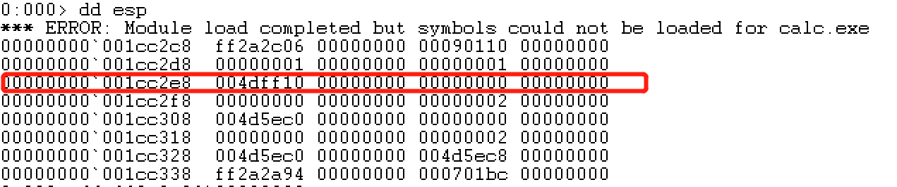
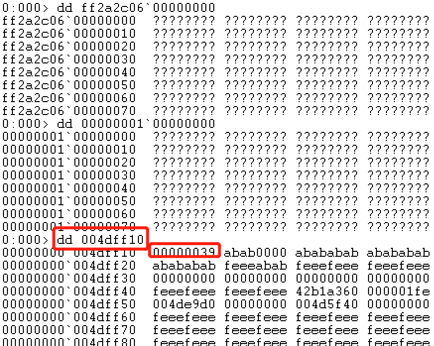

# 用windbg调试计算器
修改 64 位 Windows 7 下的计算器的显示过程，使得当计算器显示是特定数字如 "999" 的时候通过调试器脚本自动改为 "666"
## 实验环境
虚拟机准备64位win7专业版系统，并安装好增强功能，拖拽脚本文件以及windbg安装文件进win7系统
* 都忘了如何安装增强功能，点击'设备'---'安装增强功能'后没有反应？，到计算机中找C盘下面找到扩展安装包，有三个，一个64位一个32位，另外一个会自动判断应该安装哪一个
* win7可用的windbg安装：[windows7 sdk在线安装程序](https://www.microsoft.com/en-us/download/details.aspx?id=8279)中只勾选‘Debugging tool’，下载好后拖进虚拟机
## 实验步骤
1. 老师提示断电下在SetWindowTextW，因此我需要寻找它属于哪一个dll，用process monitor找不到，是因为process monitor只监控注册表、系统、网络、线程的操作，但是在[官方文档](https://docs.microsoft.com/en-us/windows/win32/api/winuser/nf-winuser-setwindowtextw)的下方找到是User32.dll
* 为什么是SetWindowTextW函数是因为无论是输出还是输入都会调用这个显示函数，而如果只想对计算结果是999显示为666的话就应该寻找'='调用的哪一个函数，并判断当用户点击'='时结果是否为999。思路不一样，与这一次实验的效果也不一样。本次实验当输入999时也会显示为666，而并没有进行计算，因此对于"计算结果999显示为666"只输入999时不会变成666
2. bu User32!SetWindowTextW "$$<C:\\Users\\root\\Desktop\\aa.txt"
* 如果提示没有符号文件，就根据提示实时拉取即可
3. 仿照老师的代码，g以后不成功，应该是内存出错
```
as /mu content poi(esp+0n24)
.block{.if($scmp("${content}","123456")==0){ezu poi(esp+0n24) "hacked";}.else{.echo content}}
g
```
* 代码分析：poi(esp+0n24)访问该地址中的值，因为是unicode的字符串所以使用/mu的参数，content表示要写入文件的内容；.block{}使得content的内容能够被正确地展开；ezu 目标 内容，将目标改成内容
4. 查看内存中的存储。下断点不导入脚本文件```bu User32!SetWindowTextW```，g直到弹出计算器，输入9，查看esp。

本来应该是第一个地址显示出9，但是发现没有，依次dd，在第三行的地址中看到9。

因此更改内存地址为32
5. 演示效果
>video/win7-windbg-calc.mp4