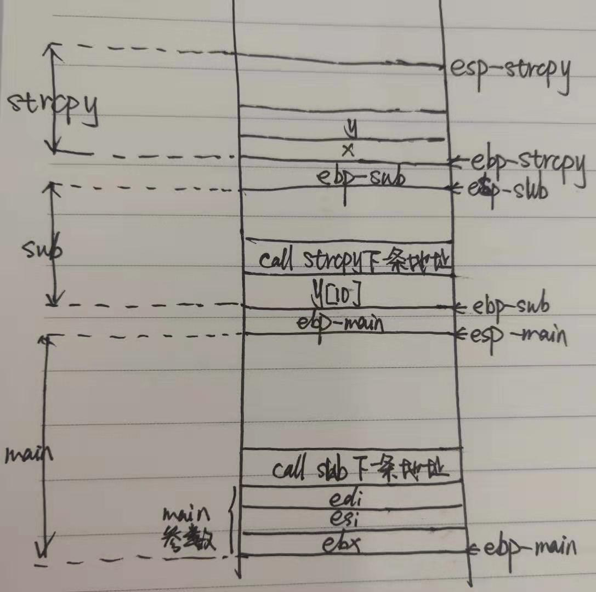

# 缓冲区溢出分析报告

## 源代码

    #define _CRT_SECURE_NO_WARNINGS

    #include <stdlib.h>
    #include <stdio.h>
    #include <string.h>

    int sub(char* x)
    {
      char y[10];
      strcpy(y, x);
      return 0;
    }

    int main(int argc, char** argv)
    {
      if (argc > 1)
      sub(argv[1]);
      printf("exit");
    }

## 反汇编代码
    
    int sub(char* x)
    {
    007D1580 55                   push        ebp  //局部变量入栈
    007D1581 8B EC                mov         ebp,esp  
    007D1583 83 EC 4C             sub         esp,4Ch  
    007D1586 53                   push        ebx  
    007D1587 56                   push        esi  
    007D1588 57                   push        edi  
    007D1589 B9 08 90 7D 00       mov         ecx,7D9008h  
    007D158E E8 1B FC FF FF       call        007D11AE  
	char y[10];
	strcpy(y, x);
    007D1593 8B 45 08             mov         eax,dword ptr [ebp+8]  
    007D1596 50                   push        eax  
    007D1597 8D 4D F4             lea         ecx,[ebp-0Ch]  
    007D159A 51                   push        ecx  
    007D159B E8 3B FC FF FF       call        007D11DB  //调用函数，并将函数下一条指令入栈
    007D15A0 83 C4 08             add         esp,8  
	return 0;
    007D15A3 33 C0                xor         eax,eax  
    }
    

    int main(int argc, char** argv)
    {
    007D1650 55                   push        ebp  //ebp入栈
    007D1651 8B EC                mov         ebp,esp  //esp指向ebp位置
    007D1653 83 EC 40             sub         esp,40h  //esp减40h,上移
    007D1656 53                   push        ebx  //ebx入栈
    007D1657 56                   push        esi  //esi入栈
    007D1658 57                   push        edi  //edi入栈
    007D1659 B9 08 90 7D 00       mov         ecx,7D9008h  //7D9008h的值给ecx
    007D165E E8 4B FB FF FF       call        007D11AE  //调用函数
	if (argc > 1)
    007D1663 83 7D 08 01          cmp         dword ptr [ebp+8],1 // 
    007D1667 7E 17                jle         007D1680  //不大于跳转，大于顺序执行
		sub(argv[1]);
    007D1669 B8 04 00 00 00       mov         eax,4  //eax=4
    007D166E C1 E0 00             shl         eax,0  //eax值没变
    007D1671 8B 4D 0C             mov         ecx,dword ptr [ebp+0Ch]//ecx的值等于ebp+0Ch的值  
    007D1674 8B 14 01             mov         edx,dword ptr [ecx+eax]  //edx的值等于ebp+0Ch+4的值
		sub(argv[1]);
    007D1677 52                   push        edx  
    007D1678 E8 73 FA FF FF       call        007D10F0  
    007D167D 83 C4 04             add         esp,4  
	printf("exit");
    007D1680 68 30 5B 7D 00       push        7D5B30h  
    007D1685 E8 AD F9 FF FF       call        007D1037  
    007D168A 83 C4 04             add         esp,4  
    }
    007D168D 33 C0                xor         eax,eax  
    007D168F 5F                   pop         edi  //之后都在出栈
    007D1690 5E                   pop         esi  
    007D1691 5B                   pop         ebx  
    007D1692 8B E5                mov         esp,ebp  
    007D1694 5D                   pop         ebp  
    007D1695 C3                   ret             //退出程序

## 分析画图

    
    
